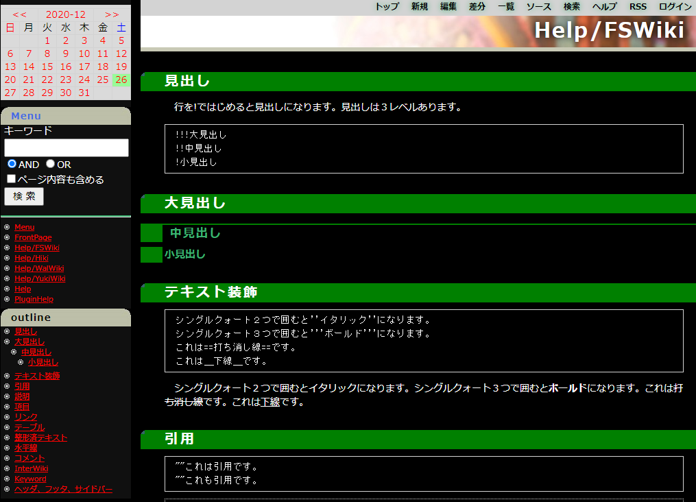

# FSWiki 用ダークテーマ kati_dark

FSWiki に標準で含まれております kitta 氏の [kati](https://fswiki.osdn.jp/cgi-bin/wiki.cgi?page=BugTrack%2Dtheme%2F4) theme をダークに変換したものです。
[Markdown Plugin や Content Security Policy (CSP) のための修正](https://kazkobara.github.io/kati_dark/docs/markdown/markdown_plugin_for_fswiki.html "https://kazkobara.github.io/kati_dark/docs/markdown/markdown_plugin_for_fswiki.html") も加えてます。

動作や見た目は自分の使っている範囲でしか確認できていないのと、画像などのパーツは改良の余地がありますので、有志の方々に
改良してもらえることを期待して(本体に取り込まれるまでは)こちらで公開してメンテナンスすることに致しました。

## スクリーンショット



## 適用方法

### 設定を変更する場合

1. FSWiki の theme/ フォルダ内に移動し

    ```shell
    git clone --depth 1 https://github.com/KazKobara/kati_dark.git
    ```

1. config/config.dat 内の `theme=` で始まる行を `theme=kati_dark` に変更するか、FSWiki画面の右上から [ログイン] -> [管理] でログインし、画面中の [スタイル設定] -> [テーマ] で "kati_dark!" を選択。

1. サイドメニューについては画面上部の [新規] で "Menu" というページを以下のような内容でご作成下さい。

    ```text
    {{calendar 予定表}}

    //!サイト内検索
    !Menu
    {{search v}}

    ----
    //!最近編集されたトップ50ページ
    {{recent 50,v}}

    //!表示ページの章立て
    ! outline

    {{outline}}
    ```

### Docker で試す場合

- [ローカルユース用 Docker FSWiki] の default theme として設定してあります。
  - [ローカルユース用 Docker FSWiki] は（インターネットで公開するサーバー用ではなく、データ自体はクラウドスレージなどと同期させるなどして、その同期したデータや手元の wiki データを）、PCのブラウザで表示させることを意図したものになります…
  - [Markdown Plugin と CSP の設定](https://github.com/KazKobara/kati_dark/tree/main/docs/markdown/markdown_plugin_for_fswiki.md)も有効になってます。

[ローカルユース用 Docker FSWiki]: https://github.com/KazKobara/dockerfile_fswiki_local "https://github.com/KazKobara/dockerfile_fswiki_local"
[Markdown Plugin と CSP の設定]: https://github.com/KazKobara/kati_dark/tree/main/docs/markdown/markdown_plugin_for_fswiki.md "https://github.com/KazKobara/kati_dark/tree/main/docs/markdown/markdown_plugin_for_fswiki.md"

<!--
  差分箇所の表示は v0.0.3 から CSP Hash を使い('unsafe-inline' や'unsafe-hashes' を許可することなく)表示されるようになっております。

  - また、「差分」メニューの差分箇所の表示はデフォルトではオフにしてあります。
    - inline scriptを用いた攻撃を受けない状況で使用される場合には、/usr/local/apache2/conf/extra/`httpd-security-fswiki-local.conf` 中において以下のように後者の行をコメントアウトし、前者を有効にすることで差分箇所を表示できるようになります。
    - ただし、SCP (Content Security Policy) の `script-src` の設定は 'unsafe-inline' でなく、script を更新し、CSP Hash または CSP Nonce を使うようにする方がより理想的な対応となります。

    ```apache
    Header always set Content-Security-Policy "default-src 'self'; script-src 'self' 'unsafe-inline';"
    # Header always set Content-Security-Policy "default-src 'self';"
    ```
-->

## 設定値の調整

### 差分表示時の背景色

「差分」メニューにおいて表示される差分箇所の背景色は黒字のテキストが見やすいように薄い色になっているため、ダーク系テーマの白字テキストに対しては少し見にくいです。見やすいようにするためには、`theme/resources/jsdifflib/diffview.css` の以下の箇所の `#RGB` を調整する必要があります。上記のローカルユース用 Docker FSWiki では[github版 jsdifflib](https://github.com/cemerick/jsdifflib)に[こちらのパッチ](https://raw.githubusercontent.com/KazKobara/dockerfile_fswiki_local/main/data/diffview_to_both_white_and_black_text.patch)をあてています。

```css
table.diff .replace {
        /* background-color:#FD8 *//* for black text */
        /* background-color:#640 *//* for white text */
        background-color:#B82      /* for both */
}
table.diff .delete {
        /* background-color:#E99 *//* for black text */
        /* background-color:#C00 *//* for white text */
        background-color:#C55      /* for both */
}
table.diff .skip {
        background-color:#EFEFEF;
        border:1px solid #AAA;
        border-right:1px solid #BBC;
}
table.diff .insert {
        /* background-color:#9E9 *//* for black text */
        /* background-color:#050 *//* for white text */
        background-color:#3C3      /* for both */
```

## TODO

- [メニュー下の帯画像](https://github.com/KazKobara/kati_dark/blob/main/himg2.jpg)の右側を背景色の黒色に合せる。
  - でないとブラウザの幅を広げた際に帯画像と背景の境目が目立つため。
  - (デザインに疎いので)、絵心のある方からの提供に期待…

---

- [https://github.com/KazKobara/](https://github.com/KazKobara/)
- [https://kazkobara.github.io/ (mostly in Japanese)](https://kazkobara.github.io/)
