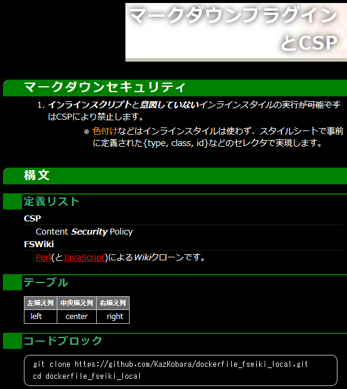
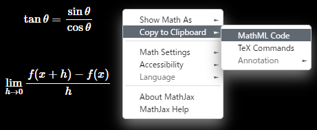

# [FreeStyleWiki (FSWiki)](https://fswiki.osdn.jp/cgi-bin/wiki.cgi) で Markdown や MathJax などを使う方法のまとめ

## はじめに

FSWiki に Markdown Plugin を入れると以下のスクリーンショットのように Markdown 構文を表示できるようになります。Markdown block 内に記述した LaTeX または MathML 形式の数式などを [MathJax](https://github.com/mathjax/MathJax/) を用いて綺麗に表示させることも可能になります。

ただし、構成により利用できる Markdown 構文が変わり、また、Webサーバの Content Security Policy (CSP) などのセキュリティを含めた設定にもひと工夫が必要ですので、このページにまとめておきます。

## スクリーンショット


<!--  -->

このスクリーンショットは以下の Markdown 文書を [kati_dark] テーマで表示させたものです。[その他のテーマ]でも使えると思います。（ただし、一部の機能は、必要に応じて [kati_dark.css] 上部の「Common Settings Among Themes」の部分をコピーする必要がある場合があります。詳しくは以下の Help/Markdown をご参照下さい。）

````markdown
# マークダウンプラグインとCSP

## マークダウンセキュリティ

1. **インライン_スクリプト_**と_**意図していない**インラインスタイル_の実行~~が可能です~~はCSPにより禁止します。
    - <span type="text/css" class="orange">色付け</span>などはインラインスタイルは使わず、スタイルシートで事前に定義された{type, class}などのセレクタで実現します。

## 構文

### 定義リスト

CSP
: Content ___Security___ Policy

=FSWiki=
    [Perl](https://www.perl.org/ "https://www.perl.org/")(と[JavaScript](https://developer.mozilla.org/en-US/docs/Web/JavaScript "JavaScript"))による*Wiki*クローンです。

### テーブル

<!-- 表の列を、中央揃え、右揃えにするには少し工夫が必要です。 -->

| 左揃え列 | 中央揃え列 | 右揃え列 |
|:---------|:----------:|---------:|
| left       |   center    |     right |

### コードブロック

```console
git clone https://github.com/KazKobara/dockerfile_fswiki_local.git
cd dockerfile_fswiki_local
```

### MathJax を用いた \\( \LaTeX \\) (およびMathML)表示

<script id="MathJax-script" async src="https://cdn.jsdelivr.net/npm/mathjax@3/es5/tex-mml-chtml.js"></script>

数式等を綺麗に表示できます。例えば、
\\( \sin^{2} \theta + \cos^{2} \theta = 1 \\),
\\( \tan \theta = \frac{\sin \theta}{\cos \theta} \\) や以下などのように
\\[ \lim_{h \to 0} \frac{f(x+h) - f(x)}{h} \\]

````

対応している Markdown 構文は、 [Help/Markdown (FSWiki版)] や [Help/Markdown (HTML版)] にまとめてあります。

## [Help/Markdown (HTML版)] の閲覧方法

1. ファイルを入手

    ```shell
    git clone https://github.com/KazKobara/kati_dark.git
    cd ./kati_dark/docs/markdown/
    ```

1. Help_Markdown_for_FreeStyleWiki.htm をブラウザで開く。

## [Help/Markdown (FSWiki版)] の閲覧方法

### FSWikiを使われていない場合

- FSWiki やその Markdown Plugin 、MathJax による LaTeX および MathML 表示などは、[ローカルユース用 Docker FSWiki]でも試すことができます。
  - デフォルトで CSP の設定なども有効になっております。

### FSWikiを使われている場合

  1. [Help/Markdown (FSWiki版)]の raw ファイルをダウンロード

        ```console
        curl -O https://raw.githubusercontent.com/KazKobara/kati_dark/main/docs/markdown/Help%252FMarkdown.wiki
        ```

  1. ダウンロードした `Help%2FMarkdown.wiki` をFSWikiの `data` フォルダ内に置き、`log/pagelist.cache` に `Help/Markdown` を追加するか、`log/pagelist.cache` を一旦削除

        > 注意:

        - [Help/Markdown (FSWiki版)]をWebブラウザの画面からコピー＆ペーストすると、いくつかの改行が削除され FSWiki 上で意図した表示となりません。
        - また、raw ファイルをWebブラウザの画面からコピー＆ペーストすると文字化けします。

<!--
以下の方法だと、後半の改行が削除されますので、FSWikiで意図した表示となりません。

  1. FSWiki の「新規」メニューボタンを押します。
  1. 現れるページ名入力用のテキストエリアに「Help/Markdown」を入力し「作成」ボタンを押します。
  1. 続いて現れる内容入力用のテキストエリアに[Help/Markdown (FSWiki版)]のテキストを貼り付けます。
     - テキストエリアに古い版が表示される場合には、その内容を削除してから貼り付けます。
     > なお、github メニューの「Copy raw contents」でコピーすると文字化けします。
  1. 「プレビュー」（または「保存」）で閲覧します。
     - Markdown Plugin が入っていない状態では markdown block 部分は、FSWikiの構文で処理されます。
     > なお、ｌFSWikiの ./data フォルダに Help%2FMarkdown.wiki を直接置くだけでは「一覧」に表示されません。 ./log/pagelist.cache に Help/Markdown を追加するか、./log/pagelist.cache を一旦削除すると表示されるようになります。
-->

## [Markdown plugin]のインストール方法

1. FSWikiの `plugin/` フォルダに移動し、`plugin/markdown/` の下に `Install.pm` と `Markdown.pm` を配置します。具体的には、

    - [markdown_20120714.zip] を展開（[gist版はこちら](https://gist.github.com/ctyo/3106157 "https://gist.github.com/ctyo/3106157")）

        ```console
        curl -o markdown_20120714.zip "https://fswiki.osdn.jp/cgi-bin/wiki.cgi?file=markdown%5F20120714%2Ezip&page=BugTrack%2Dplugin%2F417&action=ATTACH"
        unzip markdown_20120714.zip
        ```

    - [Text::Markdown]の代わりに[Text::Markdown::Discount]を使うように変更

        ```console
        sed -i.bk "s/^use Text::Markdown /use Text::Markdown::Discount /; " ./markdown/Markdown.pm
        ```

    <!-- use Text::Markdown::Discount::with_html5_tags() -->

1. [Text::Markdown::Discount] のインストール

    - git版を利用する場合

        1. 必要なコマンドのインストール
            - Ubuntu/Debianの場合

                ```console
                apt-get -y install git make gcc libperl-dev
                ```

            - Alpineの場合

                ```console
                apk add git cmake make gcc musl-dev perl-dev
                ```

        1. git版 Text::Markdown::Discount を clone し、そのフォルダへ移動

            ```console
            git clone https://github.com/KazKobara/text-markdown-discount.git -b discount-2.2.7 --depth 1
            cd text-markdown-discount
            ```

            > Discount Markdown V2保守ブランチ `v2maint` の最新版を使うための [pull request](https://github.com/sekimura/text-markdown-discount/pull/25) が取り込まれれば、`git clone https://github.com/sekimura/text-markdown-discount.git --depth 1` をご利用下さい。

        1. メイクとテスト

            ```console
            perl Makefile.PL
            make
            make test
            ```

            - 上記 make 時に ./discount/ 内で Discount の `make test` (上記の `make test` とは異なることに注意!)も行われるのですが、 diff コマンドが `-c` オプションに対応していない場合(Alpine 3.15 (BusyBox v1.34.1)など)、`discount/tools/checkbits.sh` から `c` オプションを削除し `make clean` 後に `perl Makefile.PL` からやり直して下さい。

                ```shell
                # diff -c -bw in.markdown.h in.mkdio.h
                diff -bw in.markdown.h in.mkdio.h
                ```

                > この部分の自動化は Pull request 済みです。

                - [上記の状況に陥った場合の自動リトライの追加](https://github.com/Orc/discount/pull/252)
                - おまけで、[BusyBox diff のオプションエラーコードの修正](https://github.com/mirror/busybox/pull/51)

        1. インストール

            ```console
            make install
            ```

    - Linux distributor が提供するパッケージを利用する場合
        - Ubuntu/Debian の場合

            ```console
            apt-get -y install libtext-markdown-discount-perl
            ```

        > 2022年1月時点での注意点:

        - Ubuntu/Debian が提供するパッケージを利用する場合、 Text::Markdown::Discount Ver. 0.12-1+b1 with libmarkdown2:amd64 (2.2.6-1) がインストールされます。
            - この版は、コードブロックやコロン行頭定義リストなどに対応しておりません。
            - 後継の[libtext-markdown-discount-perl]の準備も進んでいるようですので、将来的には Linux distributor が提供するパッケージを利用することでよくなると思われます。

### 古いインストール方法の備忘録

1. git版 Text::Markdown::Discount Ver. 0.13 を clone し、そのフォルダへ移動

    ```console
    git clone https://github.com/sekimura/text-markdown-discount.git --depth 1
    cd text-markdown-discount
    ```

1. [Discount本家]の Ver.2保守ブランチ `v2maint` から必要なコミットを cherry-pick しておきます。最低限、[脆弱性](https://github.com/Orc/discount/issues/189)修正コミット [b002a5a](https://github.com/Orc/discount/commit/b002a5a4db31e42dfb45451c059bc56941c17974) は取り込まなければなりません。

    ```console
    git remote add -t v2maint discount https://github.com/Orc/discount.git
    git fetch --depth 400 -n discount
    git cherry-pick -n b002a5a
    ```

    > 2022年1月時点での注意点:

    - Text::Markdown::Discount Ver.0.13 は、discount v2.1.7 に"--with-fenced-code --with-dl=both"などの修正が加えられた版が利用されます。
        - [Discount本家]のVer.2保守ブランチ `v2maint` の2022年1月時点の最新版は v2.2.7 (34a8ebb) で、v2.1.7との間に脆弱性修正のコミット b002a5a が行われているため、少なくともそれは取り込んでおく必要があります。
        - 今後、前述の Discount Markdown V2保守ブランチ 'v2maint' の最新版を使うための [pull request](https://github.com/sekimura/text-markdown-discount/pull/25) が取り込まれましたら、この cherry-pick 作業は不要となります。

## Markdown Plugin のための設定

1. Webサーバで CSP などを設定しインラインスクリプトやインラインスタイルなどを禁止

    - 詳しくは [Help/Markdown (FSWiki版)] や [httpd の場合の設定例](https://github.com/KazKobara/dockerfile_fswiki_local/blob/main/data/httpd-security-fswiki-local.conf) をご参照下さい。

1. FSWikiの設定

    - FSWiki 画面の [管理] -> [プラグイン設定 ] で markdown にチェックを入れます。
    - 上記の「[Help/Markdown (FSWiki版)] の閲覧方法」に従い [Help/Markdown (FSWiki版)] などをFSWikiで表示させCSPやMarkdown Pluginの設定を確認
    - 信頼できない第三者が Markdown を入力・編集できる場合には、Webサーバの Content Security Policy (CSP)などを設定し、インラインスクリプトやインラインスタイルを禁止して下さい。

## MathJax で LaTeX および MathML を表示させる設定

1. Discount 2.2.3以降を用いている Discount.pm 中のランタイムフラグに MKD_LATEX() を追加
    - [pull request](https://github.com/sekimura/text-markdown-discount/pull/25) が取り込まれるまでは[こちら](https://github.com/KazKobara/text-markdown-discount/blob/discount-2.2.7/lib/Text/Markdown/Discount.pm)をご参照下さい。
1. CSP（およびスタイルシート）の設定
    - 動作は、Firefox (97,98,101), Chrome (99,102), Edge (99,102) で確認
    1. Firefox, Chrome, Edge 共通の設定 ([参考](https://github.com/KazKobara/dockerfile_fswiki_local/blob/main/data/httpd-security-fswiki-local.conf ))
        - script-src に `https://cdn.jsdelivr.net/npm/mathjax@3/es5/tex-mml-chtml.js` を追加
        - font-src に `https://cdn.jsdelivr.net/npm/mathjax@3/es5/output/chtml/fonts/` を追加
    1. Chrome, Edge での追加設定
        - style-src を以下のように変更:
            - `https://cdn.jsdelivr.net/npm/mathjax@3/es5/` と `'unsafe-inline'` を一時的に追加
            - 'unsafe-hashes' とハッシュ値 'sha*' の全てを一時的に削除
                - これらのいずれかが含まれていると、より緩い設定である 'unsafe-inline' は無視されます。
        - この時点で、MathJaxにより表示された数式を右クリックし「Copy to Clipboard」を選択すると MathML 形式(または LaTeX 形式)の記述を得ることができます。

            <!--  -->
            

            > 信頼できる利用者/管理者しか使えない環境であれば、この状態での使用を検討してもよいのかもしれません。
            そうでない場合は、以下などの設定も必要になります。
        - Chrome (またはEdge)の画面を右クリックし「名前を付けて保存」->「ウェブページ、完全」でページをファイルに保存し、htm ファイルに追加されている `<style>`と`</style>` に挟まれている範囲を、そのページが読み込むスタイルシートに追加
            - その際、`.CtxtMenu`で始まるクラスの追加は不要（MathJax メニューは以下の `'unsafe-inline'` の削除により使えなくなるか使いづらいものになるため）
        - style-src の `'unsafe-inline'` (および `https://cdn.jsdelivr.net/npm/mathjax@3/es5/`) を削除し、Webサーバを再起動するなどして設定を反映
        - 新たな LaTeX 表現を追加する度に上記の追加設定を繰り返す。

    1. Firefox, Chrome , Edge 共通の設定
        - LaTeX(まはたMathML)を埋込を含むページに以下を追加

            ```html
            <script id="MathJax-script" async src="https://cdn.jsdelivr.net/npm/mathjax@3/es5/tex-mml-chtml.js"></script>
            ```

    > 注意: 設定の変更をブラウザ表示に反映させるためには、ブラウザの閲覧履歴を削除する必要があります。具体的な方法の例は以下のとおりです。

    - Chrome (102):
        1. 右上の「︙」->「その他のツール」->「閲覧履歴を削除…」
        1. 「過去1時間」などを選択し、「キャッシュされた画像とファイル」にチェックを入れ「データを削除」
    - Edge (102):
        1. 右上の「︙」->「履歴」
        1. 開かれたウィンドウ中の「履歴」横の「︙」->「「閲覧データをクリア」
        1. 「過去1時間」などを選択し、「キャッシュされた画像とファイル」にチェックを入れ「今すぐクリア」
    - Firefox (101):
        1. 右上の「≡」-> 「履歴」 -> 「最近の履歴を消去…」
        1. 「１時間以内の履歴」などを選択し、「キャッシュ」にチェックを入れ「OK」

## MathJax の version と種類

- MathJax の version は上記の `mathjax@3` を変更することで変えられます。例えば、`mathjax@3.2.0` とするなど。
  - ただし、対応するURLが存在している必要があります。
  - Versionの候補は、[MathJax githubレポジトリ](https://github.com/mathjax/MathJax) において `[master]` -> Tags などで調べられます。

<!--
同じファイルは cdnjs.cloudflare.com などからも提供されてます。3.2.0 の場合は
src="https://cdnjs.cloudflare.com/ajax/libs/mathjax/3.2.0/es5/tex-mml-chtml.js"

- MathJax の種類には、tex-mml-chtml.js 以外に SVG で出力させる tex-mml-svg.js tex-svg.js tex-svg-full.js などもあります。
  - しかしながら、MathJax の種類および version、ならびにブラウザとの組み合わせにより以下の表に示すような不具合があります。

MathJax の version と種類 | Firefox (ver.) | Chrome (ver.) | Edge (ver.) | 備考またはNGの説明
---|---|---|---|---
3.2.0 tex-mml-chtml.js tex-chtml-full.js | OK (v97) | OK (v99) | OK (v99) | ChromeとEdgeでは前述のスタイルの追加が必要
3.2.0 tex-mml-svg.js tex-svg.js tex-svg-full.js | NG (v97) | NG (v99) | NG (v99) | SVGとHTMLの両方が表示されます。
-->

## Markdownの拡張構文を有効にする方法の違い

以下の表は、Text::Markdown::Discount において以下の拡張構文

- コードブロック(Fenced Code Block)
- 行頭を「: 」にすることによる定義リスト（行頭コロンスペース定義リスト）
- タスクリスト(checkbox)）

を `./configure.sh` のオプションと `Discount.pm` 中のランタイムフラグのいずれで指定すべきかについてまとめたものになります。

- 表中の `--*` が `./configure.sh` のオプション、`MKD_*` がDiscount.pm 中のランタイムフラグになります。
- 「停止」は、そのオプションやフラグを指定すると ./configure.sh やコマンドが途中でエラー終了することを意味します。
- 「無効」はそれらを指定しても停止しないが、機能は有効にならないことを意味します。
- 例えば、
  - コードブロック構文を有効にするためには、2.1.9 (06f029e) までは `./configure.sh --with-fenced-code` とする必要がありましたが、2.1.9 (088b5ab) 以降は、それを指定しても有効にはならず、`Discount.pm` 中のランタイムフラグに MKD_FENCEDCODE() を追加する必要があります。

> なお、Text::Markdown 及び Text::Markdown::Discount の構成と対応している Markdown構文の違いは[Help/Markdown (FSWiki版)] 又は [Help/Markdown (HTML版)] をご参照下さい。

| Discount ver.2 保守ブランチ 'v2maint' のバージョン| --with-fenced-code| --with-dl=both (による行頭コロンスペース定義リスト)| --github-checkbox[=input]| MKD_FENCEDCODE| MKD_DLEXTRA (による行頭コロンスペース定義リスト)
|---|---|---|---|---|---
|2.2.4<= ver. <=2.2.7| 無効 (Invalid option)| 無効 (Setting theme default --with-dl)| 有効| 有効|有効
|2.2.0  <= ver. <=2.2.3| 無効 (Invalid option)| 無効 (Setting theme default --with-dl)| 停止 (Bad option) | 有効|有効
|2.1.9(3eb3a68)<= ver. < 2.2.0| 無効 (Invalid option)|無効 (Invalid option)| 停止 (Bad option)| 有効|有効
|2.1.9 (088b5ab)<= ver. <=2.1.9 (bde87f6)| 停止 (Invalid option)|無効 (Invalid option)| 停止 (Bad option) | 有効| 有効
|2.1.9<= ver. <=2.1.9 (06f029e) |有効| 停止 (Invalid option) | 停止 (Bad option) |  無効 (unknown option)| 有効
|2.1.8< ver. <2.1.9|有効| 停止 (Invalid option)| 停止 (Bad option) | 無効 (unknown option)|無効 (unknown option)
|2.1.6<= ver. <=2.1.8|有効|有効| 停止 (Bad option) |  無効 (unknown option)|無効 (unknown option)

## 問題解決のヒント

### FSWikiの画面に以下のようなメッセージが表示される場合

```text
markdownプラグインがインストールできません。Can't locate plugin/markdown/Install.pm in @INC (you may need to install the plugin::markdown::Install module)
```

```text
markdownプラグインは存在しません。
```

前述の「Markdown pluginのインストール」に従い、FSWikiの ./plugin/markdown/ の下に Install.pm と Markdown.pm を配置して下さい。

<!-- ## リンク -->

[kati_dark]: https://github.com/KazKobara/kati_dark "https://github.com/KazKobara/kati_dark"
[その他のテーマ]: https://fswiki.osdn.jp/cgi-bin/wiki.cgi?page=%A5%C6%A1%BC%A5%DE%B0%EC%CD%F7 "https://fswiki.osdn.jp/cgi-bin/wiki.cgi?page=%A5%C6%A1%BC%A5%DE%B0%EC%CD%F7"
[kati_dark.css]: https://raw.githubusercontent.com/KazKobara/kati_dark/main/kati_dark.css "https://raw.githubusercontent.com/KazKobara/kati_dark/main/kati_dark.css"
[ローカルユース用 Docker FSWiki]: https://github.com/KazKobara/dockerfile_fswiki_local "https://github.com/KazKobara/dockerfile_fswiki_local"
[Markdown plugin]: https://fswiki.osdn.jp/cgi-bin/wiki.cgi?page=BugTrack%2Dplugin%2F417 "https://fswiki.osdn.jp/cgi-bin/wiki.cgi?page=BugTrack%2Dplugin%2F417"
[markdown_20120714.zip]: https://fswiki.osdn.jp/cgi-bin/wiki.cgi?page=BugTrack%2Dplugin%2F417&action=ATTACH&file=markdown%5F20120714%2Ezip "https://fswiki.osdn.jp/cgi-bin/wiki.cgi?page=BugTrack%2Dplugin%2F417&action=ATTACH&file=markdown%5F20120714%2Ezip"
[Discount本家]: https://github.com/Orc/discount "https://github.com/Orc/discount"
[Help/Markdown (FSWiki版)]: https://github.com/KazKobara/kati_dark/blob/main/docs/markdown/Help%252FMarkdown.wiki "https://github.com/KazKobara/kati_dark/blob/main/docs/markdown/Help%252FMarkdown.wiki"
[Help/Markdown (HTML版)]: https://github.com/KazKobara/kati_dark/blob/main/docs/markdown/Help_Markdown_for_FreeStyleWiki.htm "https://github.com/KazKobara/kati_dark/blob/main/docs/markdown/Help_Markdown_for_FreeStyleWiki.htm"
<!--
[Help/Markdown (FSWiki版)]: https://raw.githubusercontent.com/KazKobara/kati_dark/main/docs/markdown/Help%2FMarkdown.wiki "https://raw.githubusercontent.com/KazKobara/kati_dark/main/docs/markdown/Help%2FMarkdown.wiki"
-->
[Text::Markdown]: https://metacpan.org/pod/Text::Markdown "https://metacpan.org/pod/Text::Markdown"
[Text::Markdown::Discount]: https://metacpan.org/pod/Text::Markdown::Discount "https://metacpan.org/pod/Text::Markdown::Discount"
[libtext-markdown-discount-perl]: https://launchpad.net/ubuntu/+source/libtext-markdown-discount-perl "https://launchpad.net/ubuntu/+source/libtext-markdown-discount-perl"

---
最後までお読み頂きありがとうございます。

- <https://github.com/KazKobara/>
- <https://kazkobara.github.io/>

---

## 免責事項

### 当ページの情報の正確性について

当ページのコンテンツや情報において、可能な限り正確な情報を掲載するよう努めています。しかし、誤情報が入り込んだり、情報が古くなったりすることもあります。必ずしも正確性を保証するものではありません。また合法性や安全性なども保証しません。

### 損害等の責任について

当ページに掲載された内容によって生じた損害等の一切の責任を負いかねますので、ご了承ください。
また当ページからリンクやバナーなどによって他のサイトに移動された場合、移動先サイトで提供される情報、サービス等について一切の責任も負いません。
