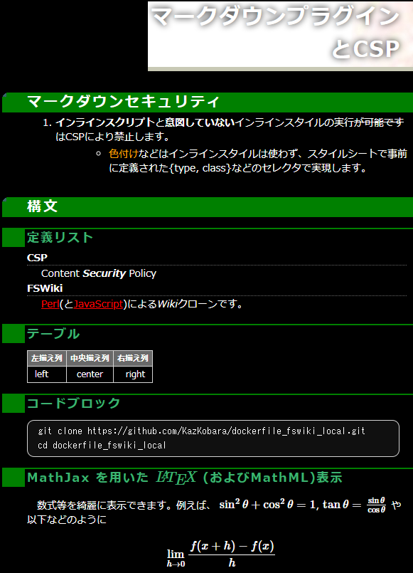

# [FreeStyleWiki (FSWiki)](https://fswiki.osdn.jp/cgi-bin/wiki.cgi) で Markdown を使う方法のまとめ

## はじめに

FSWiki に Markdown Plugin を入れると以下のスクリーンショットのように markdown block 内に記述した Markdown 構文を表示できるようになります。

ただし、Markdown Plugin として入れる部品により利用できる Markdown 構文が変わり、また、セキュリティを含めた設定にもひと工夫が必要ですので、このページにまとめておきます。

## スクリーンショット


<!--  -->

このスクリーンショットは以下の Markdown 文書を [kati_dark] テーマで表示させたものです。[その他のテーマ]でも使えると思います。（ただし、一部の機能は、必要に応じて [kati_dark.css] 上部の「Common Settings Among Themes」の部分をコピーする必要がある場合があります。）

````fswiki
# マークダウンプラグインとCSP

## マークダウンセキュリティ

1. **インライン_スクリプト_**と_**意図していない**インラインスタイル_の実行~~が可能です~~はCSPにより禁止します。
    - <span type="text/css" class="orange">色付け</span>などはインラインスタイルは使わず、スタイルシートで事前に定義された{type, class, id}などのセレクタで実現します。

## 構文

### 定義リスト

CSP
: Content ___Security___ Policy

=FSWiki=
    [Perl](https://www.perl.org/ "https://www.perl.org/")(と[JavaScript](https://developer.mozilla.org/en-US/docs/Web/JavaScript "JavaScript"))による*Wiki*クローンです。

### テーブル

<!-- 表の列を、中央揃え、右揃えにするには少し工夫が必要です。 -->

| 左揃え列 | 中央揃え列 | 右揃え列 |
|:---------|:----------:|---------:|
| left       |   center    |     right |

### コードブロック

```console
git clone https://github.com/KazKobara/dockerfile_fswiki_local.git
cd dockerfile_fswiki_local
```
````

対応している Markdown 構文は、[Help/Markdown] にまとめてあります。

## [Help/Markdown] の閲覧方法

[Help/Markdown] をテキストファイルとして直接閲覧するか、以下の方法によりFSWiki上でご参照下さい。

> FSWikiは、[ローカルユース用 Docker FSWiki]でも試すことができます(デフォルトで Markdown Plugin と CSP の設定も有効になっております）。

  1. FSWiki の「新規」メニューボタンを押します。
  1. 現れるページ名入力用のテキストエリアに「Help/Markdown」を入力し「作成」ボタンを押します。
  1. 続いて現れる内容入力用のテキストエリアに[Help/Markdown]のテキストを貼り付けます。
     - テキストエリアに古い内容が表示される場合には、その内容を削除してから貼り付けます。
     - github メニューの「Copy raw contents」でコピーすると文字化けします。
  1. 「プレビュー」（または「保存」）で閲覧します。
     - Markdown Plugin が入っていない状態では markdown block 部分は、FSWikiの構文で処理されます。

     > FSWikiの ./data フォルダに Help%2FMarkdown.wiki を直接置くだけでは「一覧」に表示されません。./log/pagelist.cache に Help/Markdown を追加するか、./log/pagelist.cache を一旦削除すると表示されるようになります。

## [Markdown plugin]のインストール方法

1. FSWikiの `./plugin/` フォルダに移動し、`./plugin/markdown/` の下に `Install.pm` と `Markdown.pm` を配置します。具体的には、

    - [markdown_20120714.zip] を展開（[gist版はこちら](https://gist.github.com/ctyo/3106157 "https://gist.github.com/ctyo/3106157")）

        ```console
        curl -o markdown_20120714.zip "https://fswiki.osdn.jp/cgi-bin/wiki.cgi?file=markdown%5F20120714%2Ezip&page=BugTrack%2Dplugin%2F417&action=ATTACH"
        unzip markdown_20120714.zip
        ```

    - [Text::Markdown]の代わりに[Text::Markdown::Discount]を使うように変更

        ```console
        sed -i.bk "s/^use Text::Markdown /use Text::Markdown::Discount /; " ./markdown/Markdown.pm
        ```

    <!-- use Text::Markdown::Discount::with_html5_tags() -->

1. [Text::Markdown::Discount] のインストール

    - git版を利用する場合

        1. 必要なコマンドのインストール
            - Ubuntu/Debianの場合

                ```console
                apt-get -y install git make gcc libperl-dev
                ```

            - Alpineの場合

                ```console
                apk add git cmake make gcc musl-dev perl-dev
                ```

        1. git版 Text::Markdown::Discount を clone しそのフォルダへ移動

            ```console
            git clone https://github.com/sekimura/text-markdown-discount.git --depth 1
            cd text-markdown-discount
            ```

        1. [Discount本家]の Ver.2保守ブランチ `v2maint` から必要なコミットを cherry-pick しておきます。最低限、[脆弱性](https://github.com/Orc/discount/issues/189)修正コミット [b002a5a](https://github.com/Orc/discount/commit/b002a5a4db31e42dfb45451c059bc56941c17974) は取り込まなければなりません。

            ```console
            git remote add -t v2maint discount https://github.com/Orc/discount.git
            git fetch --depth 400 -n discount
            git cherry-pick -n b002a5a
            ```

        1. メイク

            ```console
            perl Makefile.PL
            make
            ```

        1. テスト

            ```console
            make test
            ```

            - diff コマンドが `c` オプションに対応していない場合(Alpine 3.15 (BusyBox v1.34.1)など )、`discount/tools/checkbits.sh` から `c` オプションを削除後に上記テストを実行します。

                ```shell
                # diff -c -bw in.markdown.h in.mkdio.h
                diff -bw in.markdown.h in.mkdio.h
                ```

        1. インストール

            ```console
            make install
            ```

    - Linux distributor が提供するパッケージを利用する場合
        - Ubuntu/Debian の場合

            ```console
            apt-get -y install libtext-markdown-discount-perl
            ```

    > 2022年1月時点での注意点:

    - Ubuntu/Debian が提供するパッケージを利用する場合、 Text::Markdown::Discount Ver. 0.12-1+b1 with libmarkdown2:amd64 (2.2.6-1) がインストールされます。
        - この版は [Help/Markdown] のとおり、コードブロックやコロン行頭定義リストなどに対応しておりません。
            - \``` ```で上下を挟むコードブロックに対しては、[ktat氏によるfork版Markdown.pm](https://gist.github.com/ktat/4f15ffd29074663e0c08)を用いることで有効になりそうなのですが、こちらの環境では、なぜかうまくゆきませんでした。
        - 後継の[libtext-markdown-discount-perl]の準備も進んでいるようですので、将来的には Linux distributor が提供するパッケージを利用することでよくなると思われます。
    - 前述のgit版では Ver.0.13 がインストールされます。
        - ただし、discount は v2.1.7 に"--with-fenced-code --with-dl=both"などの修正が加えられた版が利用されます。
        - [Discount本家]のVer.2保守ブランチ(v2maint)の2022年1月時点の最新版は v2.2.7 (34a8ebb) で、v2.1.7との間に脆弱性修正のコミット b002a5a が行われているため、少なくともそれは取り込んでおく必要があります。

1. Webサーバで CSP などを設定しインラインスクリプトやインラインスタイルなどを禁止

    - 詳しくは [Help/Markdown] や [httpd の場合の設定例](https://github.com/KazKobara/dockerfile_fswiki_local/blob/main/data/httpd-security-fswiki-local.conf "https://github.com/KazKobara/dockerfile_fswiki_local/blob/main/data/httpd-security-fswiki-local.conf") をご参照下さい。

1. FSWikiの設定

    - FSWiki 画面の [管理] -> [プラグイン設定 ] で markdown にチェックを入れます。
    - 上記の「[Help/Markdown] の閲覧方法」に従い [Help/Markdown] などをFSWikiで表示させCSPやMarkdown Pluginの設定を確認
    - 信頼できない第三者が Markdown を入力・編集できる場合には、Webサーバの Content Security Policy (CSP)などを設定し、インラインスクリプトやインラインスタイルを禁止して下さい。

  > [ローカルユース用 Docker FSWiki]ではデフォルトで Markdown Plugin と CSP の設定が有効になってます。

## 問題解決のヒント

### FSWikiの画面に以下のようなメッセージが表示される場合

```text
markdownプラグインがインストールできません。Can't locate plugin/markdown/Install.pm in @INC (you may need to install the plugin::markdown::Install module)
```

```text
markdownプラグインは存在しません。
```

前述の「Markdown pluginのインストール」に従い、FSWikiの ./plugin/markdown/ の下に Install.pm と Markdown.pm を配置して下さい。

<!-- ## リンク -->

[kati_dark]: https://github.com/KazKobara/kati_dark "https://github.com/KazKobara/kati_dark"
[その他のテーマ]: https://fswiki.osdn.jp/cgi-bin/wiki.cgi?page=%A5%C6%A1%BC%A5%DE%B0%EC%CD%F7 "https://fswiki.osdn.jp/cgi-bin/wiki.cgi?page=%A5%C6%A1%BC%A5%DE%B0%EC%CD%F7"
[kati_dark.css]: https://raw.githubusercontent.com/KazKobara/kati_dark/main/kati_dark.css "https://raw.githubusercontent.com/KazKobara/kati_dark/main/kati_dark.css"
[ローカルユース用 Docker FSWiki]: https://github.com/KazKobara/dockerfile_fswiki_local "https://github.com/KazKobara/dockerfile_fswiki_local"
[Markdown plugin]: https://fswiki.osdn.jp/cgi-bin/wiki.cgi?page=BugTrack%2Dplugin%2F417 "https://fswiki.osdn.jp/cgi-bin/wiki.cgi?page=BugTrack%2Dplugin%2F417"
[markdown_20120714.zip]: https://fswiki.osdn.jp/cgi-bin/wiki.cgi?page=BugTrack%2Dplugin%2F417&action=ATTACH&file=markdown%5F20120714%2Ezip "https://fswiki.osdn.jp/cgi-bin/wiki.cgi?page=BugTrack%2Dplugin%2F417&action=ATTACH&file=markdown%5F20120714%2Ezip"
[Discount本家]: https://github.com/Orc/discount "https://github.com/Orc/discount"
[Help/Markdown]: https://github.com/KazKobara/kati_dark/blob/main/docs/markdown/Help%252FMarkdown.wiki "https://github.com/KazKobara/kati_dark/blob/main/docs/markdown/Help%252FMarkdown.wiki"
<!--
[Help/Markdown]: https://raw.githubusercontent.com/KazKobara/kati_dark/main/docs/markdown/Help%2FMarkdown.wiki "https://raw.githubusercontent.com/KazKobara/kati_dark/main/docs/markdown/Help%2FMarkdown.wiki"
-->
[Text::Markdown]: https://metacpan.org/pod/Text::Markdown "https://metacpan.org/pod/Text::Markdown"
[Text::Markdown::Discount]: https://metacpan.org/pod/Text::Markdown::Discount "https://metacpan.org/pod/Text::Markdown::Discount"
[libtext-markdown-discount-perl]: https://launchpad.net/ubuntu/+source/libtext-markdown-discount-perl "https://launchpad.net/ubuntu/+source/libtext-markdown-discount-perl"

---
最後までお読み頂きありがとうございます。

- <https://github.com/KazKobara/>
- <https://kazkobara.github.io/>

---

## 免責事項

### 当ページの情報の正確性について

当ページのコンテンツや情報において、可能な限り正確な情報を掲載するよう努めています。しかし、誤情報が入り込んだり、情報が古くなったりすることもあります。必ずしも正確性を保証するものではありません。また合法性や安全性なども保証しません。

### 損害等の責任について

当ページに掲載された内容によって生じた損害等の一切の責任を負いかねますので、ご了承ください。
また当ページからリンクやバナーなどによって他のサイトに移動された場合、移動先サイトで提供される情報、サービス等について一切の責任も負いません。
